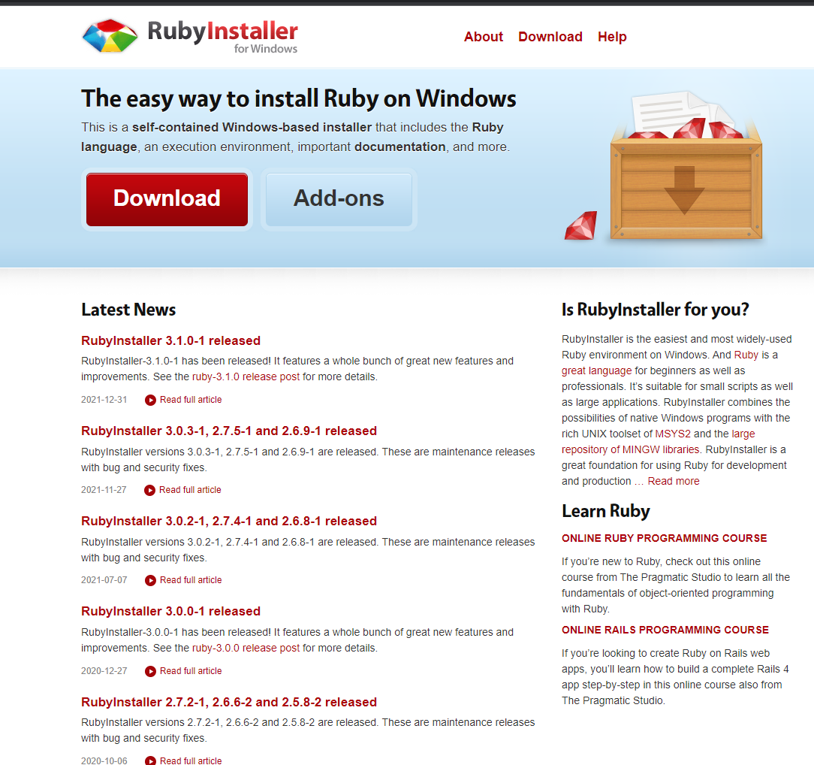

## Git Blog 
  

 - Github repository에 있는 html과 같은 **static website**를 제공하는 서비스
 - Git을 사용하는 유저는 누구나 1개씩 웹사이트 주소를 제공받을 수 있음  

  

 

## Jekyll

 - **루비(Ruby) 베이스의 정적 웹사이트 생성기(static websites generator)**
 - Template과 Contents 등에서 텍스트 데이터를 읽어서 정적 웹사이트를 생성
 - markdown 파일을 html 파일로 변환하여 웹사이트를 구축
 - 동적 웹사이트는 지원하지 않음(Flask, Django 등을 활용) 

 

## Ruby 설치 

Github을 통해서만 블로그를 확인한다면 루비를 굳이 설치할 필요가 없다. 하지만 로컬 환경에서 블로그를 구축하고 확인하기를 원한다면 루비 설치가 필요하다. 

1. https://rubyinstaller.org 접속

2. with Devkit에서 진하게 표시된 Ruby 설치 

3. Ruby 설치가 완료되면 

